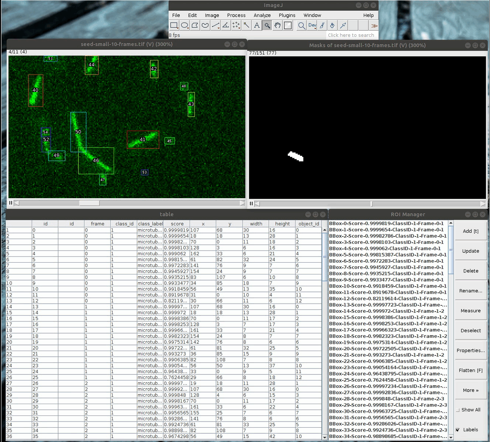

# `maskflow-fiji`: Object Detection and Segmentation
[](https://travis-ci.org/hadim/maskflow-fiji)

A Fiji plugin for object detection and tracking based on [Mask RCNN](https://arxiv.org/abs/1703.06870).

It allows object detection, segmentation and tracking using a pre-trained model with the associated [`maskflow` Python package](https://github.com/hadim/maskflow).

**IMPORTANT: This plugin is a proof of concept and in a very early stage. At the moment only a simple model to detect microtubules is provided. I hope to be able to continue the development at some point.**

## Usage

- Start [Fiji](https://imagej.net/Fiji/Downloads).
- Click on `Help ▶ Update...`.
- In the new window, click on `Manage update sites`.
- Scroll to find `Maskflow` in the column `Name`. Click on it.
- Click `Close` and then `Apply changes`.
- Restart Fiji.
- Open your image.
- Run the commands at `Plugins ► Maskflow`.

## Screenshots



## Scripting

Here is an example script:

```python
# @Dataset data
# @CommandService cs
# @ModuleService ms

from sc.fiji.maskflow import ObjectDetector

inputs = {"model": None,
          "modelName": "Microtubule",
          "dataset": data,
          "fillROIManager": True}}
module = ms.waitFor(cs.run(ObjectDetector, True, inputs))

table = module.getOutput("table")
masks = module.getOutput("masks")
```

The plugin also comes with an object tracker based on the centroid of the detected masks:

```python
# @Dataset data
# @CommandService cs
# @ModuleService ms

from sc.fiji.maskflow import ObjectDetector
from sc.fiji.maskflow import ObjectTracker

inputs = {"model": None,
          "modelName": "Microtubule",
          "dataset": data,
          "fillROIManager": True}
module = ms.waitFor(cs.run(ObjectDetector, True, inputs))

table = module.getOutput("table")
masks = module.getOutput("masks")

inputs = {"masks": masks,
          "table": table,
          "linkingMaxDistance": 10,
          "gapClosingMaxDistance": 10,
          "maxFrameGap": 5,
          "fillROIManager": True}
          
module = ms.waitFor(cs.run(ObjectTracker, True, inputs))
table = module.getOutput("resultTable")

```

There is also a command that combine both detection and tracking:

```python
# @Dataset data
# @CommandService cs
# @ModuleService ms

from sc.fiji.maskflow import ObjectDetectAndTrack

inputs = {"model": None,
          "modelName": "Microtubule",
          "dataset": data,
          "linkingMaxDistance": 10,
          "gapClosingMaxDistance": 10,
          "maxFrameGap": 5,
          "fillROIManager": True}
module = ms.waitFor(cs.run(ObjectDetectAndTrack, True, inputs))

table = module.getOutput("resultsTable")
masks = module.getOutput("masks")

```

## Available Models

| Objects | Version | Description | Image Size | URL |
| --- | --- | --- | --- | --- |
| Microtubule | 0.1 | WIP | 1280x1280 | https://storage.googleapis.com/nn-models/microtubule-v0.1.zip |

## GPU Support

This type of neural networks are much more faster on GPU than CPU. To enable GPU support you need to manually replace `libtensorflow_jni.jar` to `libtensorflow_jni_gpu.jar` in your Fiji `jars/` folder.

## Authors

`maskflow-fiji` has been created by [Hadrien Mary](mailto:hadrien.mary@gmail.com).

## License

MIT. See [LICENSE.txt](LICENSE.txt)